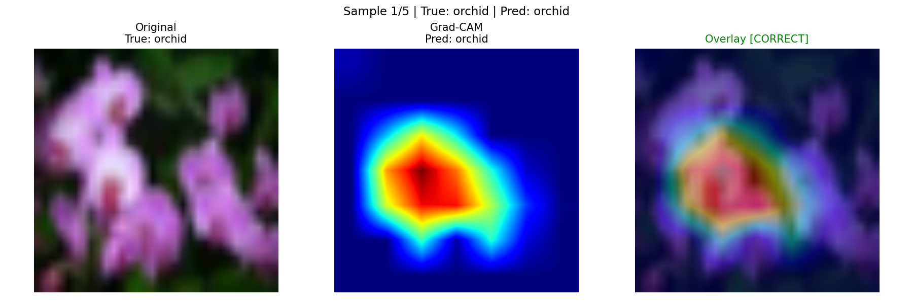
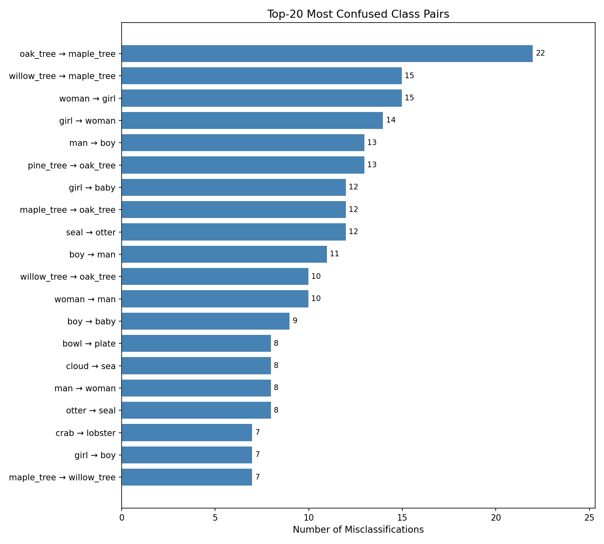
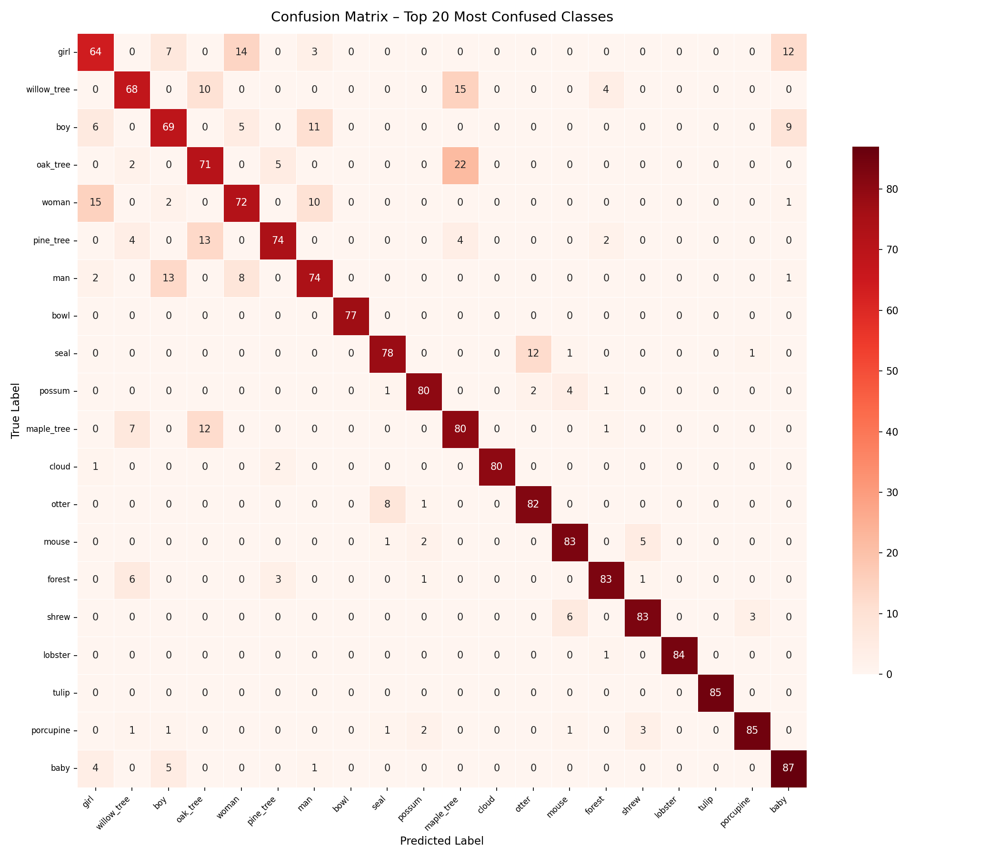

# CIFAR-100 — SOTA-level Performance For EfficientNetV2-S & Runs Fully On-Device (Mobile) — Real-Time Camera Inference in Browser

A production-grade EfficientNetV2-S pipeline achieving **90.20% validation accuracy** on CIFAR-100 using advanced optimization techniques including SAM and SWA — with real-time browser inference via ONNX, reaching **SOTA-level performance for EfficientNetV2-S**.
> 🚀 **90.20% Accuracy | SOTA-level performance for EfficientNetV2-S | Runs Fully On-Device (Mobile) — Real-Time Camera Inference in Browser**

---


## 📌 Overview

This project is a comprehensive deep learning pipeline designed to achieve **high accuracy** and **low-latency inference** on the CIFAR-100 dataset (100 classes, 60,000 images) using the **EfficientNetV2-S** architecture.

The model was iteratively refined across **13 training stages** — from an 81.13% baseline to a final **90.20% validation accuracy** — using modern augmentation strategies, SAM optimization, and Stochastic Weight Averaging. The final model is exported to **FP32 ONNX** and runs **live in the browser** via a standalone HTML interface with WebGPU acceleration.

---

## 💡 Why This Project Matters

- Demonstrates **architecture-level optimization** rather than switching to larger models
- Achieves **SOTA-level performance for EfficientNetV2-S**
- End-to-end pipeline: training → explainability → deployment
- Runs fully **in-browser with no backend required**

## 🚀 Key Features

| Feature | Details |
|:---|:---|
| **Architecture** | EfficientNetV2-S — superior parameter efficiency and training speed |
| **Data Augmentation** | MixUp + CutMix hybrid, RandomResizedCrop, Soft RandAugment, RandomErasing |
| **Optimizer** | Sharpness-Aware Minimization (SAM), ρ=0.05 |
| **Loss Function** | CrossEntropy + Label Smoothing (Stages 1–8.3) / Focal Loss (Stage 8.4) |
| **LR Scheduling** | OneCycleLR with dynamic warm-up |
| **Weight Averaging** | Stochastic Weight Averaging (SWA) across best checkpoints |
| **Explainability** | GradCAM + Confusion Matrix + Most Confused Pairs |
| **Export** | PyTorch (.pth) → ONNX FP32 → ONNX FP16 (38 MB) |
| **Deployment** | Live browser inference via WebGL fallback |

---

## 📁 Project Structure

```
CIFAR100Project/
│
├── data/
├── LRFinder/
├── ONNX/
│   └── Code/
│       ├── To_ONNX.py
│       └── ONNXTest.py
├── Quantization_ONNX/
│   └── Code/
│       ├── Quantization.py
│       └── QuantizationTest.py
├── ModelLastTest/
│   └── Code/
│       └── best_model_Test.py
├── research_journey/
│   ├── test1/ ... test8.4/
│   │   └── Code/
│   └── TestSWA/
│       └── Code/
└── UseMobile/
    └── index.html
```

---

## ⚙️ Requirements

- Python 3.10+
- CUDA 12.x (optional — CPU inference also supported)
- 8 GB+ VRAM recommended for training

```
torch>=2.0.0
torchvision>=0.15.0
onnx>=1.14.0
onnxruntime-gpu>=1.16.0
timm>=0.9.0
numpy>=1.24.0
Pillow>=9.5.0
tqdm>=4.65.0
matplotlib>=3.7.0
```

---

## 🛠️ Quick Start

**1. Clone the repository**

```bash
git clone https://github.com/Burak599/cifar100-effnetv2-90.20acc-mobile-inference.git
cd cifar100-effnetv2-90.20acc-mobile-inference
```

**2. Create a virtual environment**

```bash
python3 -m venv venv
source venv/bin/activate      # Linux/macOS
# venv\Scripts\activate       # Windows
```

**3. Install dependencies**

```bash
pip install -r requirements
# Windows:
npm install -g serve
# Linux/macOS:
sudo npm install -g serve

# Open a new terminal and run this command there.
# windows:
winget install cloudflare.cloudflared

# linux:
curl -L https://github.com/cloudflare/cloudflared/releases/latest/download/cloudflared-linux-amd64.deb -o cloudflared.deb && sudo dpkg -i cloudflared.deb

#Mac:
brew install cloudflare/cloudflare/cloudflared

#Note!!!: Node.js is required for npm commands.

```

**4. Download pre-trained weights**

All weights are hosted on HuggingFace: https://huggingface.co/brk9999/efficientnetv2-s-cifar100

```bash
pip install huggingface_hub

python -c "
from huggingface_hub import snapshot_download
snapshot_download(
    repo_id='brk9999/efficientnetv2-s-cifar100',
    allow_patterns='best_weight/*',
    local_dir='pretrained_weights/'
)
"

# If you want to download the weights for all 12 training scripts (approximately 1.5 GB), use the following command:
python -c "
from huggingface_hub import snapshot_download
snapshot_download(
    repo_id='brk9999/efficientnetv2-s-cifar100',
    allow_patterns='research_journey_weights/*',
    local_dir='pretrained_weights/'
)
"
```

Pretrained weights stay in pretrained_weights/; training outputs always go to the user_weights/ folder in the active script's directory. These two paths remain strictly separate.

---

## 📊 ModelAccTest

**1. Navigate to the test directory**

```bash
cd ModelLastTest/Code
```

**2. Run the accuracy evaluation script**

```bash
python best_model_Test.py
```

---

## 📊 Results — From 81% → 90.20%

### Validation Accuracy Progression

| ID | Val Acc | Key Changes |
|:---:|:---:|:---|
| 1 | 81.13% | Initial baseline |
| 2 | 81.87% | 40 epochs + seed fix + CenterCrop |
| 3 | 83.13% | Lower LR (1.5e-3) + Soft RandAug |
| 4 | 85.34% | MixUp (α=0.8) + LR (7e-4) + RandomErasing |
| 5 | 86.45% | MixUp + CutMix hybrid |
| 6 | 87.35% | SAM optimizer (ρ=0.05) + 120 epochs |
| 7 | 86.53% | Resume + Dropout (0.3) |
| 8 | 88.17% | 200 epochs + RandomResizedCrop + SAM |
| 8.1 | 89.18% | Base progressive refinement |
| **8.2** | **89.86%** | **Relaxed MixUp/CutMix + lower LR ⭐ Best single model** |
| 8.3 | 89.69% | No MixUp + reduced augmentation |
| 8.4 | 89.78% | Focal Loss + weight decay |
| SWA | 89.81% | Weight averaging (8.2 + 8.4) |
| **FULL** | **90.20%** | **🏆 Final best weights** |

### GradCAM — Sample Prediction



### Top-20 Most Confused Class Pairs



### Confusion Matrix



---

## 🏋️ Training

>Pretrained weights stay in pretrained_weights/; training outputs always go to the user_weights/ folder located inside each script's own directory. These two never interfere.

Each stage has its own self-contained script, no arguments needed:

```bash
# Stage 8.2 — Best single model (89.86%) ⭐
python "research_journey/Test8/Code/cifar100_test8.py"
#Run this to view the XAI analysis after training Test 8.
python "research_journey/Test8/XAI8/XAICode8.py"

python "research_journey/Test8Resume1/Code/test8resume.py"
#Run this to view the XAI analysis after training Test 8.1.
python "research_journey/Test8Resume1/XAI8.1/XAICode8.1.py"

python "research_journey/Test8Resume2/Code/test8resume2.py"
#Run this to view the XAI analysis after training Test 8.2.
python "research_journey/Test8Resume2/XAI8.2/XAICode8.2.py"


---

##📈 Training Notes

>Early Convergence: The model typically reaches its best validation accuracy within 10-20 epochs (observed in cifar100_test8.py), even though the total training is set to 200 epochs.

## 📤 Export Pipeline

```bash
# Step 1 — PyTorch → ONNX FP32
python "ONNX/Code/To_ONNX.py"

# Step 2 — Test ONNX FP32
python "ONNX/Code/ONNXTest.py"

# Step 3 — ONNX FP32 → FP16 (38 MB)
python "Quantization_ONNX/Code/Quantization.py"

# Step 4 — Test ONNX FP16
python "Quantization_ONNX/Code/QuantizationTest.py"
```

---

## 📱 Real-Time Mobile Inference (No Backend)

The model runs **live in the browser** — no server, no Python, no installation required.

- Runs entirely in-browser using ONNX
- No server or Python required
- Real-time camera-based classification

```bash
cd cifar100-effnetv2-90.20acc-mobile-inference
npx serve --cors -l 8080 
# Open a new terminal
cloudflared tunnel --url http://127.0.0.1:8080 --protocol http2 
```

Get the Public URL: After running the Cloudflare command(cloudflared tunnel --url http://127.0.0.1:8080 --protocol http2 ), look for a URL in the terminal that looks like https://xxx-xxx-xxx.trycloudflare.com.

Open on Mobile: Open this link in your mobile browser.

Navigate to the App: * Locate and click on the UseMobile folder.

    Click on index.html to launch the inference interface.

Wait for Initialization: * Grant camera permissions when prompted.

    Please wait while the model loads (this may take a few moments depending on your connection).

Note!!!: If you encounter a 1033 error when opening the link, please follow these steps:

    Stop both the npx serve and cloudflared tunnel processes (Press Ctrl+C in your terminals).

    First, run the command: npx serve --cors -l 8080.

    Wait for 1 minute.

    Then, run the command: cloudflared tunnel --url http://127.0.0.1:8080 --protocol http2.

Note!!!: If you get a 'load failed' error when opening index.html, stop both trycloudflare and npx serve, then restart them.

- Captures live camera feed and classifies every frame in real time
- Runs via **WebGL** 
- Displays predicted class name
- Works completely offline after first load

---

## 📦 Model Weights

All weights on HuggingFace: https://huggingface.co/brk9999/efficientnetv2-s-cifar100

| Checkpoint | Val Acc | Format | Size |
|:---|:---:|:---:|:---:|
| Stage 8.2 ⭐ Best | 89.86% | `.pth` 
| Stage 8.4 | 89.78% | `.pth` 
| SWA Merged | 89.81% | `.pth` 
| **Final ONNX** | **90.20%** | **`.onnx`** |

---

## 🔬 Explainability (XAI)

Running `best_model_fp16Test.py` automatically generates:

- **GradCAM** (5 samples) — shows which image regions the model focuses on, with correct/incorrect label overlay
- **Confusion Matrix** — Top-20 most confused classes with raw count heatmap
- **Most Confused Pairs** — Top-20 class pairs by misclassification count (`oak_tree → maple_tree`: 25, `boy → man`: 14)

---

## 🤝 Contributing

1. Fork the repository
2. Create a feature branch: `git checkout -b feature/your-feature`
3. Commit your changes: `git commit -m 'Add some feature'`
4. Push to the branch: `git push origin feature/your-feature`
5. Open a Pull Request

---

## 🙏 Acknowledgements

- [timm](https://github.com/huggingface/pytorch-image-models) — EfficientNetV2-S backbone
- [SAM Optimizer](https://github.com/davda54/sam) — Sharpness-Aware Minimization
- [ONNX Runtime Web](https://onnxruntime.ai/) — browser inference engine
- [EfficientNetV2 Paper](https://arxiv.org/abs/2104.00298) — Mingxing Tan & Quoc V. Le
- CIFAR-100 — Alex Krizhevsky

---

## 📄 License

This project is licensed under the **MIT License** — see the [LICENSE](LICENSE) file for details.

---

Made with ❤️ by [Burak599](https://github.com/Burak599) — ⭐ If this project helped you, please give it a star!
